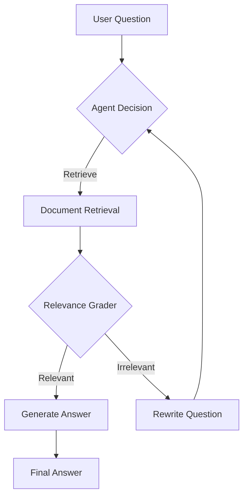

# Agentic RAG-based QA System with LangChain 🦜️🔗

[](https://python.langchain.com)
[](https://openai.com/)
[](https://www.trychroma.com/)

<p align="center">
  
</p>

A sophisticated question-answering system implementing Retrieval-Augmented Generation (RAG) with agentic decision-making capabilities using LangChain and LangGraph.

## Key Features ✨

- **Agentic Workflow**: Stateful decision-making process using LangGraph
- **Dynamic Document Retrieval**: ChromaDB vector store with configurable chunking
- **Relevance Grading**: LLM-powered document relevance assessment
- **Self-Improving Queries**: Automatic query rewriting for better retrieval
- **Modular Architecture**: Easily extendable components for customization
- **Multi-Model Support**: Configurable OpenAI models for different tasks
- **Evaluation Ready**: Pre-configured test cases with answer verification

## Installation ⚙️

1. Clone repository:
```bash
git clone https://github.com/dkleptsov/agentic_rag.git
cd agentic_rag
```

2. Install dependencies:
```bash
pip install -r requirements.txt
```

3. Set up environment variables:
```bash
echo "OPENAI_API_KEY=your_api_key_here" > .env
```

## Configuration 🛠️
Modify config.py to customize system behavior:
```python
# Data handling
DATABASE_DIR = "vector_db"            # ChromaDB storage location
DATA_FILE = "data/anna_karenina.txt"  # Source document

# Model configurations
GRADER_MODEL = "gpt-4o"               # Document relevance grading
REWRITE_MODEL="gpt-4o-2024-08-06"     # Query rewriting
GENERATE_MODEL = "gpt-4o-mini"        # Answer generation
AGENT_MODEL = "gpt-4-turbo"           # Decision-making agent
OPENAI_TEMPERATURE = 0                # Temperature of the model answers

# Text processing
CHUNK_SIZE = 1000                     # Document chunk size
CHUNK_OVERLAP = 200                   # Chunk overlap

# Evaluation
QUESTION_ANSWER_PAIRS = [             # Test questions with expected answers
    ("What is Anna Karenina's opening line?", 
     "Happy families are all alike..."),
    # Add more QA pairs
]
```

## Usage 🚀
```python
from agentic_rag import ask_question

question = "What is the novel's perspective on family dynamics?"
answer = ask_question(question)
print(f"Answer: {answer}")
```
Example output:
```
Question: What is Anna Karenina's opening line?
RAG answer: The famous opening line of Leo Tolstoy's Anna Karenina is:
"Happy families are all alike; every unhappy family is unhappy in its own way."
Correct answer: Happy families are all alike...
```

## System Architecture 🏛️


Core Components:
1. Intelligent Agent (LLM)
- Makes retrieval decisions
- Manages conversation state
- Orchestrates workflow
2. Document Retriever
- ChromaDB vector store
- Recursive text splitting
- Semantic search
3. Relevance Grader
- Binary document assessment
- Prevents irrelevant context usage
- Configurable threshold
4. Query Rewriter
- Improves search effectiveness
- Semantic query transformation
- Feedback loop integration
5. Answer Generator
- RAG-powered responses
- Multi-model support
- Streamable output

## 📁 Structure of the project
```
├── chroma_db                       # Directory for ChromaDB vector store
├── data                            # Directory for input data
│   └── anna-karenina.txt           # Text file containing the source document
├── images                          # Directory for visual assets
│   └── Agentic_RAG.png             # Diagram or screenshot of the system architecture
├── agentic_rag.py                  # Main script for the Agentic RAG-based QA system
├── config.py                       # Configuration file for model and system settings
├── README.md                       # Project documentation and overview
└── requirements.txt                # List of Python dependencies for the project
```

## Contributing 🤝
Contributions are welcome! Please follow these steps:

1. Fork the repository
2. Create your feature branch (git checkout -b feature/amazing-feature)
3. Commit your changes (git commit -m 'Add some amazing feature')
4. Push to the branch (git push origin feature/amazing-feature)
5. Open a Pull Request

## Disclaimer ⚠️
This system uses OpenAI language models. Please ensure:

- You comply with OpenAI's usage policies
- Sensitive data is properly handled
- API costs are monitored
